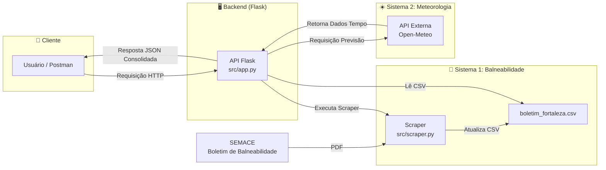

# API de Balneabilidade e Previsão do Tempo - Praias de Fortaleza

## Descrição

Este projeto consiste em uma **API RESTful** desenvolvida em **Python** com **Flask**, que realiza a integração de dois sistemas distintos para fornecer dados consolidados sobre as condições das praias de Fortaleza, Ceará. A API combina informações sobre a balneabilidade (qualidade da água para banho) com dados meteorológicos atualizados.

As fontes de dados integradas são:

* Superintendência Estadual do Meio Ambiente (SEMACE): Os dados de balneabilidade são obtidos através de um script de web scraping (scraper.py) que extrai e processa o boletim semanal mais recente diretamente do site da SEMACE.

* API Open-Meteo: Utilizando as coordenadas geográficas de cada praia, a aplicação consome a API externa Open-Meteo para obter previsões do tempo detalhadas, incluindo temperatura, velocidade do vento e altura das ondas.

## Objetivo do Trabalho

O objetivo principal deste projeto é desenvolver uma solução prática que demonstre as competências adquiridas na disciplina de Técnicas de Integração de Sistemas. Para isso, foi criada uma API RESTful que atende aos seguintes requisitos acadêmicos:

* Integrar no mínimo dois sistemas distintos: A solução integra dados públicos da SEMACE (via web scraping) com uma API externa de meteorologia (Open-Meteo).

* Desenvolver uma API funcional: Utilizando Python e Flask para criar endpoints que seguem os princípios da arquitetura REST.

* Documentar a solução: Criar uma documentação clara e detalhada, incluindo um README.md, rotas da API e uma coleção para testes no Postman.

* Garantir a qualidade do código: Implementar testes unitários automatizados para os principais endpoints da aplicação.

Este projeto está diretamente alinhado ao Objetivo de Desenvolvimento Sustentável (ODS) 11 da ONU: Cidades e Comunidades Sustentáveis.

A solução contribui especificamente para a Meta 11.7, que visa "proporcionar o acesso universal a espaços públicos seguros, inclusivos, acessíveis e verdes". As praias de Fortaleza são espaços públicos vitais para o lazer, turismo e bem-estar da comunidade.

Ao transformar dados públicos brutos (boletins em PDF) em informação acessível via API, o projeto capacita cidadãos e turistas a tomar decisões informadas sobre o uso desses espaços. Saber se uma praia está 'Própria' ou 'Imprópria' para banho, combinado com a previsão do tempo, promove a segurança e a saúde, permitindo que todos desfrutem da orla de Fortaleza de forma mais consciente e segura.

## Descrição funcional da solução

A API de Balneabilidade de Fortaleza é uma ferramenta que centraliza e fornece dados sobre as condições das praias da cidade. Do ponto de vista funcional, a solução permite que um usuário final (ou outra aplicação) realize as seguintes operações:

1. Consultar a Balneabilidade: Obter a lista de praias monitoradas pela Superintendência Estadual do Meio Ambiente (SEMACE), com o status atualizado de "Própria" ou "Imprópria" para banho.

2. Obter Previsão do Tempo: Para qualquer praia, solicitar dados meteorológicos detalhados para uma data futura, como temperatura, velocidade do vento e altura das ondas.

3. Filtrar Resultados: Pesquisar praias por zona geográfica (Leste, Centro, Oeste) ou por status de balneabilidade.

Para garantir que os dados sejam sempre recentes, a aplicação executa um *script* de *scraping* automaticamente ao ser iniciada, buscando o último boletim de balneabilidade disponível no site da SEMACE.

## Arquitetura da API

A arquitetura do projeto foi desenhada para integrar duas fontes de dados, seguindo o modelo requisição-resposta da arquitetura RESTful.

### Descrição da Arquitetura
1. **Sistema 1 (Dados de Balneabilidade)**: Um *script* (scraper.py) coleta os dados do site da SEMACE. Ele baixa o boletim em PDF, extrai as informações e as salva de forma estruturada em um arquivo local (boletim_fortaleza.csv).

2. **Núcleo da API (Orquestrador)**: A aplicação Flask (app.py) atua como o centro da solução. Ela lê os dados locais de balneabilidade e os expõe através de seus *endpoints*.

3. **Sistema 2 (Dados Meteorológicos)**: Quando um *endpoint* de previsão é acionado, a API Flask utiliza as coordenadas da praia para fazer uma requisição em tempo real à API externa **Open-Meteo**, buscando os dados de previsão.

4. **Consolidação**: A API combina as informações de balneabilidade e previsão do tempo em uma única resposta JSON e a entrega ao cliente.

5.  **Documentação Interativa (Swagger):** A API utiliza a biblioteca `Flasgger` para gerar uma documentação no padrão OpenAPI. As definições de cada endpoint são mantidas em arquivos `.yml` separados (na pasta `src/swagger_docs`), que são lidos pela aplicação para construir a interface do Swagger UI.

### Considerações sobre as Fontes de Dados
Para a correta utilização da API, é fundamental compreender a periodicidade e a disponibilidade dos dados das fontes integradas:

* **Boletins da SEMACE (Balneabilidade)**: Os dados de balneabilidade são baseados nos boletins semanais da SEMACE. A API foi projetada para buscar e processar sempre o boletim mais recente disponível publicamente. Contudo, a própria SEMACE pode não atualizar os boletins em uma data rigorosamente fixa. Isso significa que pode haver um pequeno atraso na publicação, e o boletim mais recente pode ainda se referir à semana anterior. Se um usuário solicitar uma data para a qual o boletim ainda não foi liberado, a API retornará os dados do último período válido.

* **API Open-Meteo (Previsão do Tempo)**: A previsão do tempo é fornecida em tempo real pela API Open-Meteo. Esta API oferece previsões para uma janela de tempo limitada (geralmente até 7 dias no futuro a partir da data atual). Portanto, não é possível obter previsões para datas muito distantes ou para o passado através deste endpoint. Se uma data fora desse intervalo for solicitada, a API indicará que os dados de previsão não estão disponíveis.

### Diagrama da Arquitetura



## Instruções de Execução e Teste

Siga os passos abaixo para executar a API localmente e realizar testes com o Postman.

### 1. Executando a API Localmente

**Pré-requisitos:**
- Python 3.10+
- Git

**Passos:**
1.  **Clone o repositório:**
    ```bash
    git clone [https://github.com/SEU-USUARIO/NOME-DO-REPOSITORIO.git](https://github.com/SEU-USUARIO/NOME-DO-REPOSITORIO.git)
    cd NOME-DO-REPOSITORIO
    ```
2.  **Crie e ative um ambiente virtual:**
    * **Windows:**
        ```bash
        python -m venv .venv
        .\.venv\Scripts\activate
        ```
    * **macOS/Linux:**
        ```bash
        python3 -m venv .venv
        source .venv/bin/activate
        ```
3.  **Instale as dependências:**
    O arquivo `requirements.txt` contém todas as bibliotecas necessárias. Instale-as com o comando:
    ```bash
    pip install -r requirements.txt
    ```
4.  **Configure o Ambiente Flask (Apenas na primeira vez):**
    Para que o comando `flask run` funcione corretamente, crie um arquivo chamado `.flaskenv` na **pasta raiz do projeto** e adicione a seguinte linha dentro dele:
    ```
    FLASK_APP=src/app.py
    ```
5.  **Execute a Aplicação:**
    Com o arquivo `.flaskenv` criado, basta usar o comando padrão do Flask na raiz do projeto:
    ```bash
    flask run
    ```
    A API estará rodando em `http://127.0.0.1:5000`.

### 2. Instruções para Execução via Postman

A coleção api-balneabilidade-fortaleza.postman_collection.json está na pasta **postman** do repositório para facilitar os testes.

1. Com a API rodando localmente (passo anterior), abra o aplicativo Postman.

2. Clique em  "File" e em seguinda em "Import" no canto superior esquerdo.

3. Na janela que se abrir, navegue até a pasta do projeto e selecione o arquivo api-balneabilidade-fortaleza.postman_collection.json.

4. Após a importação, uma nova coleção com todas as requisições da API aparecerá na sua barra lateral esquerda, já organizada em pastas.

5. Clique em qualquer requisição (ex: "Listar Todas as Praias" dentro da pasta "Praias") e clique no botão "Send" para ver a resposta da API.

## Documentação das Rotas da API

A API possui uma documentação interativa completa e auto-gerada utilizando **Swagger (OpenAPI)**, que é a fonte definitiva de informações sobre os endpoints.

Para explorar, entender os parâmetros e testar cada rota em tempo real, acesse a interface do Swagger UI após iniciar a aplicação localmente:

### **[Acesse a Documentação Interativa aqui: http://127.0.0.1:5000/apidocs](http://127.0.0.1:5000/apidocs)**

### Resumo dos Endpoints

Abaixo está uma tabela de referência rápida com os principais endpoints disponíveis.

| Método | Endpoint                      | Descrição                                                              |
| :----- | :---------------------------- | :--------------------------------------------------------------------- |
| `GET`  | `/`                           | Retorna uma mensagem de boas-vindas e um resumo da API.                |
| `GET`  | `/praias`                     | Lista um resumo de todas as praias monitoradas (id, nome, zona).       |
| `GET`  | `/praias/{id}`                | Busca informações detalhadas de uma praia específica pelo seu `id`.      |
| `GET`  | `/praias/{id}/data`           | Retorna o boletim e a previsão do tempo para uma praia em uma data específica. **Parâmetro obrigatório:** `?data=YYYY-MM-DD`. |
| `GET`  | `/praias/status/{status}`     | Filtra praias por status (`propria` ou `impropria`). **Parâmetro opcional:** `?data=...` para incluir previsão. |
| `GET`  | `/praias/zona/{zona}`         | Filtra praias pela zona (`Leste`, `Centro`, `Oeste`). **Parâmetro opcional:** `?data=...` para incluir previsão. |

## Documentação Adicional

Esta seção contém informações complementares para a compreensão total do projeto, incluindo a estratégia de testes e a organização do código-fonte.

### Testes e Qualidade de Código (Pytest)

Conforme solicitado na atividade, o projeto inclui uma suíte de **testes unitários** para garantir o funcionamento correto dos endpoints da API.

Os testes estão localizados no diretório `tests/` e foram desenvolvidos com o framework `Pytest`.
- **`test_app.py`**: Contém os casos de teste para cada uma das rotas da API. Ele valida tanto respostas de sucesso (código 200) quanto o tratamento de erros esperado para entradas inválidas (códigos 404, 400, etc.).
- **`conftest.py`**: É um arquivo de configuração do Pytest que fornece *fixtures* e *mocks*. Os mocks simulam as respostas das APIs externas (SEMACE e Open-Meteo), permitindo que os testes sejam executados de forma rápida e isolada, sem depender de uma conexão real com a internet.

#### Como Executar os Testes
Com o ambiente virtual ativado, execute o seguinte comando na raiz do projeto:
```bash
pytest -v
```
### Estrutura do Repositório
O projeto segue uma estrutura organizada para separar o código-fonte, os testes e a documentação.
