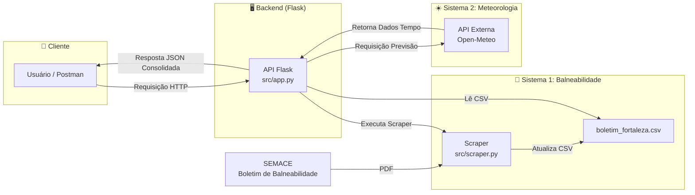

# Arquitetura da API e Diagrama

A arquitetura do projeto foi desenhada para integrar duas fontes de dados, seguindo o modelo **requisição-resposta** da arquitetura **RESTful**.

### Descrição da Arquitetura
1.  **Sistema 1 (Dados de Balneabilidade):** Um script (`scraper.py`) coleta os dados do site da SEMACE. Ele baixa o boletim em PDF, extrai as informações e as salva de forma estruturada em um arquivo local (`boletim_fortaleza.csv`).
2.  **Núcleo da API (Orquestrador):** A aplicação Flask (`app.py`) atua como o centro da solução. Ela lê os dados locais de balneabilidade e os expõe através de seus endpoints.
3.  **Sistema 2 (Dados Meteorológicos):** Quando um endpoint de previsão é acionado, a API Flask utiliza as coordenadas da praia para fazer uma requisição em tempo real à API externa **Open-Meteo**.
4.  **Consolidação:** A API combina as informações de balneabilidade e previsão do tempo em uma única resposta JSON e a entrega ao cliente.
5.  **Documentação Interativa (Swagger):** A API utiliza a biblioteca `Flasgger` para gerar uma documentação interativa no padrão OpenAPI. As definições de cada endpoint são mantidas em arquivos `.yml` separados (na pasta `src/swagger_docs`), que são lidos pela aplicação para construir a interface do Swagger UI.

### Considerações sobre as Fontes de Dados
- **Boletins da SEMACE:** Os dados são baseados nos boletins **semanais**. A API busca sempre o boletim mais recente, mas a SEMACE pode ter atrasos na publicação.
- **API Open-Meteo:** As previsões do tempo são para uma **janela de tempo limitada** (geralmente até 7 dias no futuro). Datas muito distantes não retornarão dados.

### Diagrama da Arquitetura

