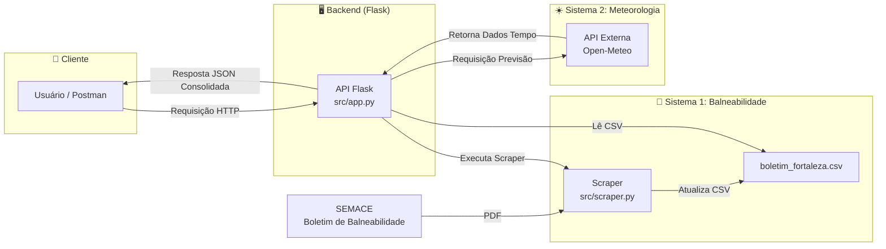

```mermaid
graph LR
    %% Blocos principais
    subgraph "👤 Cliente"
        A[Usuário / Postman]
    end

    subgraph "🖥️ Backend (Flask)"
        B["API Flask<br/>src/app.py"]
    end

    subgraph "🌊 Sistema 1: Balneabilidade"
        D["Scraper<br/>src/scraper.py"]
        E["boletim_fortaleza.csv"]
    end

    subgraph "☀️ Sistema 2: Meteorologia"
        F[API Externa<br/>Open-Meteo]
    end

    %% Fonte externa SEMACE
    SEMACE["SEMACE<br/>Boletim de Balneabilidade"]

    %% Fluxo
    SEMACE -->|PDF| D
    D -->|Atualiza CSV| E
    B -->|Executa Scraper| D
    B -->|Lê CSV| E
    B -->|Requisição Previsão| F
    F -->|Retorna Dados Tempo| B
    A -->|Requisição HTTP| B
    B -->|Resposta JSON Consolidada| A

```